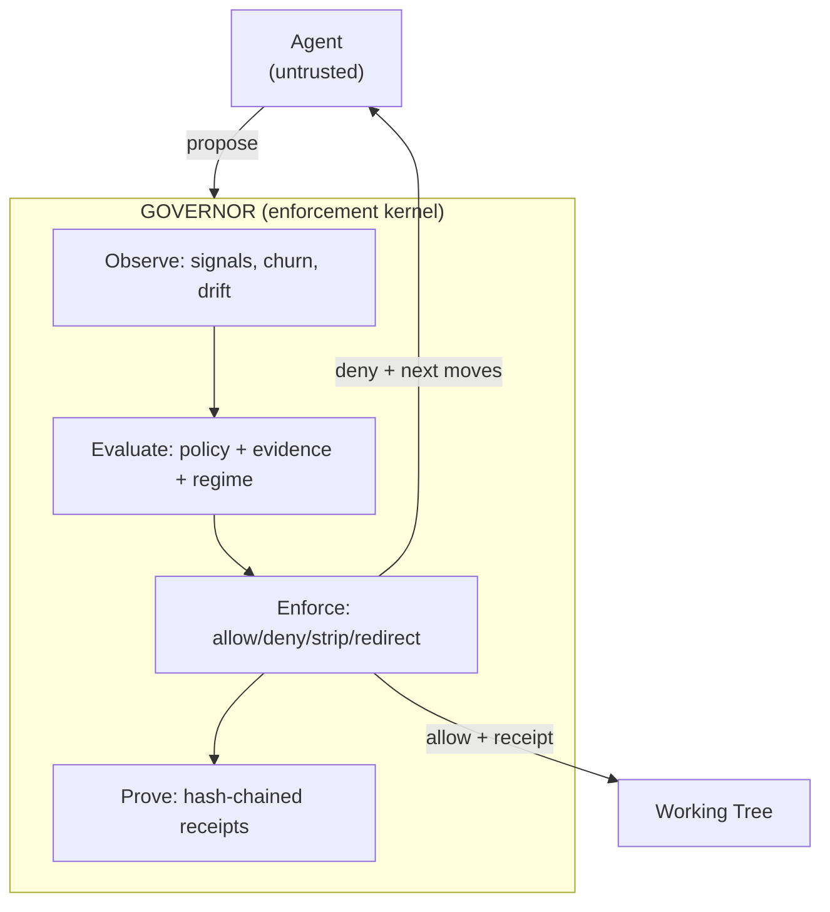

# Agent Governor

**Enforcement kernel for tool-using LLM workflows.** Constrains capabilities over time, detects failure modes (loops, drift, hallucinated completion), and produces tamper-evident receipts for audit and replay.

11,000+ tests. Zero trust. Agents propose — only the governor commits.

## What Actually Happens

```
Agent proposes:  web.search("auth bypass techniques")  (attempt 4, same query class)
Governor sees:   tool churn + low novelty + budget burn
Governor acts:   DENY + DOWNGRADE (strip web tool, force local reasoning)
Agent receives:  {reason: "tool_churn_detected", allowed_next: ["read_file", "propose_plan"], expiry: "3 turns"}
Agent replans:   continues with reduced capability set
```

This is the difference between a **validator** (checks if a call is well-formed) and a **governor** (decides whether this call should exist *at this point in the run*, given observed behavior, constraints, and prior evidence).

A governor doesn't just say "no." It **denies, downgrades, forces replan, strips tools, caps retries, expires tasks, and emits a machine-readable receipt explaining why.**

## Non-Goals

- Not an agent framework. Does not run your agent.
- Not "alignment." Does not make models good.
- Not a confidence-score system. Confidence without evidence is theater.
- Not a policy document. It's an enforcement boundary with teeth.

---

## The Enforcement Loop

```
propose → observe → evaluate → enforce → feedback → replan → continue
          ↑                                                    ↓
          └────────────────── receipts ─────────────────────────┘
```

Five verbs make a governor:

| Verb | What It Does |
|------|-------------|
| **Observe** | Track signals across time: looping, divergence, novelty decay, cost slope, tool churn |
| **Decide** | Apply policy over state, regime, stage, and accumulated evidence |
| **Enforce** | Allow / deny / strip / expire / throttle / downgrade |
| **Redirect** | Require replan with fewer degrees of freedom (tool stripping, stage shift) |
| **Prove** | Emit receipts that bind claims, actions, and evidence into a tamper-evident chain |

"Tool gateway" is a leaf of this system, not its center.

---

## The Problem

You're using Claude Code, Cursor, or Codex. The agent:
- Hallucinates APIs that don't exist
- Contradicts itself between sessions
- Drifts from architectural decisions you made yesterday
- Gives you no audit trail for why things changed
- Burns money on retry loops nobody notices
- Requires a human babysitter for every action

**That's not agentic development. That's expensive remote control.**

## The Solution

Agent Governor enforces the **Non-Linguistic Authority Invariant (NLAI)**:

> Language is a proposal, not an authority.

The agent can *claim* anything. But it can't *write* anything until it provides verifiable evidence.

- Agent says "tests pass"? Governor runs the tests and produces a receipt.
- Agent says "file exists"? Governor checks and hashes the file.
- Agent says "we decided on React"? Governor checks the ledger for contradictions.

**No hallucination can fake a receipt.**

---

## Failure Modes We Detect

Not abstract risks. Specific signals with specific enforcement actions.

| Failure Mode | Signal | Enforcement |
|---|---|---|
| Infinite research loop | Low novelty, high tool churn | Strip tools, force local reasoning |
| Hallucinated completion | "Done" claim without evidence | DENY, require oracle evidence |
| Tool misuse / escalation | Out-of-scope tool calls | Scope governor blocks, escalation receipt |
| Silent downgrade | Agent skips work, claims success | Exit shape checking, custody scoring |
| Prompt leakage / evasion | Policy-violating output | Continuity checker, violation resolver |
| Temporal drift | Contradicts prior decisions | Claim diff, premise quarantine |
| Review theater | Rubber-stamp merge patterns | Comprehension gate, throughput coupling |
| Retry spiral | Same action, same failure, burning budget | Scar tissue (hysteresis), budget caps |

---

## Quick Start

```bash
pip install -e .
governor init

# Record a decision
governor propose --claim "Using React for frontend" --topic framework
governor verify 1 && governor apply 1

# Now try to contradict it
governor propose --claim "Using Vue for frontend" --topic framework
# REJECTED — Contradicts existing decision on 'framework'
```

### Fiction: Protect Your Canon

```bash
governor continuity anchor add \
  --id "elena-eyes" --type canon \
  --description "Elena has green eyes" \
  --forbidden "Elena's blue eyes" "her blue eyes" \
  --severity reject

governor check chapter-3.md --mode fiction
```

### Code: Enforce Decisions

```bash
governor intent set --profile production --scope "src/auth/**"
governor check src/auth/login.py

# Compare models on a task
governor interferometry compare "Add auth middleware" \
  --backends claude:sonnet,ollama:qwen
```

### Operations: Enforce Runbooks

```bash
ops-gov verify --runbook deploy-v2.yaml --window maintenance
```

### Evidence Gate: Kernel-Only Surface

```bash
# Check agent output against kernel constraints
governor gate check "All tests pass. The auth module is thread-safe."
# → HARD claim "thread-safe" flagged: no oracle evidence

# Verify a kernel run
governor kernel verify --run <id>
# → Verdict: FAIL | confidence.sanity: HIGH_CONFIDENCE_WEAK_EVIDENCE
```

---

## Architecture



**Threat model:**
- Agents are untrusted. They hallucinate, contradict, drift, loop, escalate.
- The host is trusted. Governor runs locally.
- Defends against: fabricated claims, unverified writes, temporal drift, epistemic amplification, retry spirals, capability creep, silent downgrades.
- Does NOT defend against: compromised host, malicious dependencies (see [ETHICAL_HARDENING.md](specs/gaps/ETHICAL_HARDENING.md)).

---

## Modes

| Mode | Mental Model | What It Governs |
|------|-------------|-----------------|
| **Code** | "My architectural decisions" | Decisions, constraints, API surfaces, test requirements |
| **Fiction** | "My story bible" | Characters, world rules, canon, tone, consent |
| **Nonfiction** | "My research corpus" | Sources, claims, citations, frame intrusion |
| **Ops** | "My runbooks" | Blast radius, time windows, preconditions |

Same engine, different constraints. The governor doesn't care what domain you're in — it cares that claims have evidence.

---

## What's In The Box

### Core Governance (~390 tests)
Typed claims, cryptographic receipts, FSM lifecycle, fact/decision ledgers with decay, operating envelopes, git pre-commit hooks, MCP server.

### Multi-Agent Coordination (~120 tests)
SQLite WAL backend, agent leases, epochs, permissions, task dispatcher protocol.

### Epistemic Stack (~980 tests)
Provenance tracking, confidence modeling, quorum consensus, drift detection, claim diffing, premise dependencies, agent roles, TTL enforcement, dissent ledger, taint similarity.

### Autonomous Execution (~230 tests)
Spine locking, invariant specs, execution budgets, session manager, step-function executor with checkpoint/resume.

### Adaptive Control (~530 tests)
Regime detection (ELASTIC/WARM/DUCTILE/UNSTABLE), boil control presets, homeostat with exploration budgets, ultrastability (S1 adaptation), failure provenance with scars/shields, auto-tuning with Pareto analysis.

### Evidence Gate + Receipt Kernel (~240 tests)
Evidence-gated coding harness, claim extraction, custody scoring, hash-chained kernel runs with 12 constitutional invariants, verdict ceiling, oracle evidence classes.

### Writing Governance (~920 tests)
11 modules: tone vectors (6D), affect regimes, governance visibility scoring, intent classification, structural constraints, prose/code ticketing, puppet mode.

### Fiction Governor (~380 tests)
Plot threads, scene proposals, canon ledger, manuscript scanning, context drift detection, consent tracking, narrative guardrails (DSI, AII).

### Non-Fiction Governor (~280 tests)
Corpus management, DOI fetching, citation verification, contextual frame intrusion detection (12-frame taxonomy).

### Ops Governor (~60 tests)
Runbook verification, time window enforcement, blast radius limits, precondition chains.

### Interferometry (~90 tests)
Multi-model claim comparison (parallel + serial modes), code-specific risk markers (19 types), anchor compatibility checking, divergence signals.

### Integrations (~560 tests)
[VS Code extension](https://github.com/unpingable/vscode-governor), [WebUI](https://github.com/unpingable/governor_webui) (FastAPI + chat bridge), SDK middleware, MCP safety controls, session continuity, git/Perforce governance, external constraint attachment (Wikidata/Wikipedia/Scholar).

### Infrastructure (~960 tests)
Structured telemetry, Prometheus metrics, config profiles, continuity enforcement, convergence auto-tuning, QA harness, golden-file/property-based/contract tests.

**Total: ~11,000 tests across 60+ modules.**

---

## Key Concepts

| Concept | What It Means |
|---------|--------------|
| **NLAI** | Language is a proposal, not an authority |
| **Gate, not memory** | Write-blocking, not advisory logging |
| **Facts vs decisions** | "Tests pass" decays. "We use React" persists. |
| **Typed claims** | `ClaimType.TESTS_PASS`, not "I think the tests pass" |
| **Receipts** | Content-addressed, hash-chained proof of verification |
| **Custody scoring** | Ap (accountability) x Ip (invariant coupling) x Fp (failure explicitness) |
| **Scar tissue** | Failed actions create lasting constraints (hysteresis) |
| **Regime detection** | ELASTIC/WARM/DUCTILE/UNSTABLE — not vibes, measured signals |
| **Verdict ceiling** | Structural invariant failure caps the best possible verdict |

---

## Admissibility, Not Correctness

This system does not prove agents are "right." It proves whether an action was **admissible** under declared rules, evidence, and risk constraints at the time it was taken.

What a receipt proves:

- **Authorization**: the agent was allowed to take this action under an explicit policy
- **Constraints**: the action satisfied (or violated) declared limits
- **Evidence basis**: what was checked, what remained unresolved, which gates passed
- **Waivers**: any override was intentional, attributed, and leaves a scar

When outcomes are bad, the question shifts from "why did it do that?" (storytime) to **"was this admissible under the declared rules?"** (audit).

> [Full treatment: docs/ADMISSIBILITY.md](docs/ADMISSIBILITY.md) | [Compliance mapping: docs/COMPLIANCE.md](docs/COMPLIANCE.md)

---

## Comparison: Validators vs Governors

| | Validator / Middleware | Agent Governor |
|---|---|---|
| **Scope** | Single call | Full run lifecycle |
| **State** | Stateless | Tracks signals, regimes, budgets over time |
| **Denial** | Exception / retry | Structured downgrade + allowed next moves |
| **Evidence** | Optional | Cryptographic receipts required |
| **Write control** | None | Write gate enforced |
| **Failure detection** | Schema validation | Loops, drift, hallucinated completion, escalation |
| **Architecture** | I/O filter | Enforcement kernel with policy, regime, and stage |

Both are useful. Validators check shape. Governors constrain behavior over time.

---

## CLI Highlights

```bash
# Core
governor init / propose / verify / apply
governor facts / decisions / status

# Evidence gate
governor gate check <text>              # Evidence-gated coding harness
governor kernel verify --run <id>       # Verify kernel run (12 invariants)

# Checking
governor check <path>                   # Unified security + continuity

# Profiles & Intent
governor profile use production         # Named governance presets
governor intent set --profile hotfix    # Intent-based governance

# Interferometry
governor compare "task" --backends a,b  # Multi-model comparison
governor interferometry divergence      # Disagreement signals

# Epistemic
governor epistemic status / claims / dangerous
governor drift status / update
governor quorum status <id>

# Adaptive
governor regime status                  # ELASTIC/WARM/DUCTILE/UNSTABLE
governor boil set oolong                # Named control presets
governor explore enter research         # Exploration budgets

# Autonomous
governor autonomous run --task "..."    # Step-function execution
governor spine lock <id>                # Lock project structure
governor invariant check                # Mechanically verify rules

# Integration
governor hook install                   # Git pre-commit
governor mcp serve                      # MCP server for Claude
governor claude-hooks install           # Claude Code hooks
```

Full CLI reference: 100+ commands across 30+ subsystems. See `.claude/rules/cli-reference.md`.

---

## Installation

```bash
# From source
git clone https://github.com/unpingable/agent_governor
cd agent_governor
pip install -e ".[dev]"

# Run tests
python3 -m pytest tests/ -v

# WebUI
bash start.sh                           # Claude Code backend
bash start-codex.sh                     # Codex backend
```

---

## Documentation

| Document | Contents |
|----------|----------|
| `docs/WHY.md` | Motivation and field context |
| `CLAUDE.md` | Architecture rules, claim types, receipt types |
| `BUILD_SPEC.md` | Step-by-step build guide, FSM, receipt design |
| `MULTI_AGENT.md` | Concurrency model, conflict detection, dispatcher |
| `docs/ADMISSIBILITY.md` | Why receipts prove admissibility, not correctness |
| `docs/COMPLIANCE.md` | Fiduciary law mapping (ERISA, SEC, process-based prudence) |
| `docs/CLIENT_ECOSYSTEM.md` | Client roles, transport posture, fleet primitives |
| `specs/gaps/ETHICAL_HARDENING.md` | Ethical failure modes + enforceable invariants |
| `specs/` | 25+ design specs |

---

## Why "Governor"?

In mechanical systems, a governor limits speed to prevent damage — the spinning-ball mechanism on steam engines.

In AI systems, the Agent Governor limits autonomy to prevent hallucination.

A validator is a bouncer. A governor is the **building inspector + fire marshal + accounting department**, and it can shut down floors mid-event.

---

## License

Apache-2.0

---

*Agents propose. Governors verify. Receipts don't lie.*
