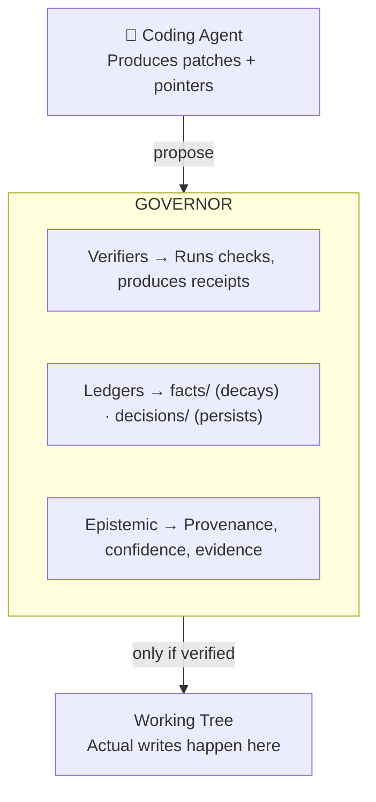

# Agent Governor

**Constraint system for AI coding agents. 8,000+ tests. Zero trust.**

Agents can *propose*. Only the governor can *commit*.
Agent provides pointers. Governor produces receipts.
No write hits disk unless verification succeeds.

*Unsure if this applies to you? Ask your LLM whether it should be allowed to act without it.*

### Fiction: Protect your canon


### Code: Enforce decisions


### Security: Catch what agents introduce


---

## The Problem

You're using Claude Code, Cursor, or Codex. The agent:
- Hallucinates APIs that don't exist
- Contradicts itself between sessions
- Drifts from architectural decisions you made yesterday
- Gives you no audit trail for why things changed
- Requires a human babysitter for every action

**That's not agentic development. That's expensive remote control.**

## The Solution

Agent Governor enforces the **Non-Linguistic Authority Invariant (NLAI)**:

> Language is a proposal, not an authority.

The agent can *claim* anything. But it can't *write* anything until it provides verifiable evidence.

- Agent says "tests pass"? Governor runs the tests and produces a receipt.
- Agent says "file exists"? Governor checks and hashes the file.
- Agent says "we decided on React"? Governor checks the ledger for contradictions.

**No hallucination can fake a receipt.**

---

## Quick Start

```bash
pip install -e .
governor init

# Record a decision
governor propose --claim "Using React for frontend" --topic framework
governor verify 1 && governor apply 1

# Now try to contradict it
governor propose --claim "Using Vue for frontend" --topic framework
# REJECTED — Contradicts existing decision on 'framework'
```

### For Writers

```bash
# Protect canon
governor continuity anchor add \
  --id "elena-eyes" --type canon \
  --description "Elena has green eyes" \
  --forbidden "Elena's blue eyes" "her blue eyes" \
  --severity reject

# Check your chapter
governor check chapter-3.md --mode fiction
```

### For Developers

```bash
# Set intent and check code
governor intent set --profile production --scope "src/auth/**"
governor check src/auth/login.py

# Compare models on a task
governor interferometry compare "Add auth middleware" \
  --backends claude:sonnet,ollama:qwen
```

### For Operations

```bash
# Enforce runbook constraints
ops-gov verify --runbook deploy-v2.yaml --window maintenance
```

---

## Architecture



**Threat model:**
- Agents are untrusted. They hallucinate, contradict, drift.
- The host is trusted. Governor runs locally.
- Defends against: fabricated claims, unverified writes, temporal drift, epistemic amplification.
- Does NOT defend against: malicious dependencies, compromised host.

---

## What's In The Box

### Core Governance (~380 tests)
Typed claims, cryptographic receipts, FSM lifecycle, fact/decision ledgers with decay, operating envelopes, git pre-commit hooks, MCP server.

### Multi-Agent Coordination (~120 tests)
SQLite WAL backend, agent leases, epochs, permissions, task dispatcher protocol.

### Epistemic Stack (~980 tests)
Provenance tracking, confidence modeling, quorum consensus, drift detection, claim diffing, premise dependencies, agent roles, TTL enforcement, dissent ledger, taint similarity.

### Autonomous Execution (~230 tests)
Spine locking, invariant specs, execution budgets, session manager, step-function executor with checkpoint/resume.

### Adaptive Control (~530 tests)
Regime detection (ELASTIC/WARM/DUCTILE/UNSTABLE), boil control presets, homeostat with exploration budgets, ultrastability (S1 adaptation), failure provenance with scars/shields, auto-tuning with Pareto analysis.

### Writing Governance (~920 tests)
11 modules: tone vectors (6D), affect regimes, governance visibility scoring, intent classification, structural constraints, prose/code ticketing, puppet mode.

### Fiction Governor (~380 tests)
Plot threads, scene proposals, canon ledger, manuscript scanning, context drift detection, consent tracking, narrative guardrails (DSI, AII).

### Non-Fiction Governor (~280 tests)
Corpus management, DOI fetching, citation verification, contextual frame intrusion detection (12-frame taxonomy).

### Ops Governor (~60 tests)
Runbook verification, time window enforcement, blast radius limits, precondition chains.

### Interferometry (~90 tests)
Multi-model claim comparison (parallel + serial modes), code-specific risk markers (19 types), anchor compatibility checking, divergence signals.

### Integrations (~560 tests)
VS Code extension, WebUI (FastAPI + chat bridge), SDK middleware, MCP safety controls, session continuity, git/Perforce governance, external constraint attachment (Wikidata/Wikipedia/Scholar).

### Infrastructure (~960 tests)
Structured telemetry, Prometheus metrics, config profiles, continuity enforcement, convergence auto-tuning, QA harness, golden-file/property-based/contract tests.

**Total: ~8,000 tests across 60+ modules.**

---

## Modes

| Mode | Mental Model | What It Governs |
|------|-------------|-----------------|
| **Code** | "My architectural decisions" | Decisions, constraints, API surfaces, test requirements |
| **Fiction** | "My story bible" | Characters, world rules, canon, tone, consent |
| **Nonfiction** | "My research corpus" | Sources, claims, citations, frame intrusion |
| **Ops** | "My runbooks" | Blast radius, time windows, preconditions |

Same engine, different constraints. The governor doesn't care what domain you're in — it cares that claims have evidence.

---

## Key Concepts

| Concept | What It Means |
|---------|--------------|
| **NLAI** | Language is a proposal, not an authority |
| **Gate, not memory** | Write-blocking, not advisory logging |
| **Facts vs decisions** | "Tests pass" decays. "We use React" persists. |
| **Typed claims** | `ClaimType.TESTS_PASS`, not "I think the tests pass" |
| **Receipts** | SHA-256 hashed proof of verification at a point in time |
| **Custody scoring** | Ap (accountability) x Ip (invariant coupling) x Fp (failure explicitness) |
| **Interferometry** | Multi-model divergence as instrumentation, not selection |
| **Scar tissue** | Failed actions create lasting constraints (hysteresis) |

---

## Comparison: Memory vs Governance

| | Memory Tools | Agent Governor |
|---|-------------|----------------|
| **Purpose** | Help agent remember | Prevent ungrounded commits |
| **Trust model** | Forgetful but helpful | Unreliable, require proof |
| **Verification** | Optional | Cryptographic receipts required |
| **Write control** | None | Write gate enforced |
| **Architecture** | Memory prosthetic | Epistemic security |

Both are useful. They solve different problems. Use memory tools for continuity. Use Agent Governor for safety.

---

## Failure Modes Observed in the Wild

Industry analyses (e.g., 1Password's [*From Magic to Malware*](https://1password.com/blog/from-magic-to-malware-how-openclaws-agent-skills-become-an-attack-surface)) document how agent "skills" and tool chaining become attack surfaces when autonomy is not bounded by explicit authority, adjudication, and auditability — including supply chain attacks via skill registries where markdown documentation becomes a malware delivery vector.

The mitigations proposed (default-deny execution, sandboxing, time-bound permissions, provenance logging) describe the same structural requirements the Agent Governor enforces: typed claims require receipts, writes require verified proposals, and no tool execution escapes the gate. The difference is between post-hoc remediation and pre-execution constraint enforcement.

---

## CLI Highlights

```bash
# Core
governor init / propose / verify / apply
governor facts / decisions / status

# Checking
governor check <path>                    # Unified security + continuity
governor lite check <text>               # Evidence-gated coding harness

# Profiles & Intent
governor profile use production          # Named governance presets
governor intent set --profile hotfix     # Intent-based governance

# Interferometry
governor compare "task" --backends a,b   # Multi-model comparison
governor interferometry divergence       # Disagreement signals

# Epistemic
governor epistemic status / claims / dangerous
governor drift status / update
governor quorum status <id>

# Adaptive
governor regime status                   # ELASTIC/WARM/DUCTILE/UNSTABLE
governor boil set oolong                 # Named control presets
governor explore enter research          # Exploration budgets

# Autonomous
governor autonomous run --task "..."     # Step-function execution
governor spine lock <id>                 # Lock project structure
governor invariant check                 # Mechanically verify rules

# Integration
governor hook install                    # Git pre-commit
governor mcp serve                       # MCP server for Claude
governor claude-hooks install            # Claude Code hooks
```

Full CLI reference: 100+ commands across 30+ subsystems. See `.claude/rules/cli-reference.md`.

---

## Installation

```bash
# From source
git clone https://github.com/unpingable/agent_governor
cd agent_governor
pip install -e ".[dev]"

# Run tests
python3 -m pytest tests/ -v

# WebUI
bash start.sh                            # Claude Code backend
bash start-codex.sh                      # Codex backend
```

---

## Documentation

| Document | Contents |
|----------|----------|
| `CLAUDE.md` | Architecture rules, claim types, receipt types, conventions |
| `BUILD_SPEC.md` | Step-by-step build guide, FSM, receipt design |
| `MULTI_AGENT.md` | Concurrency model, conflict detection, dispatcher |
| `CONTRIBUTING.md` | Branch workflow, testing requirements |
| `specs/` | 25+ design specs (core theory, UX, interferometry) |
| `docs/` | User guides, architecture docs, mode-specific guides |

---

## Why "Governor"?

In mechanical systems, a governor limits speed to prevent damage — the spinning-ball mechanism on steam engines.

In AI systems, the Agent Governor limits autonomy to prevent hallucination.

**Speed without control is just chaos.**

---

## License

Apache-2.0

---

*Agents propose. Governors verify. Receipts don't lie.*
