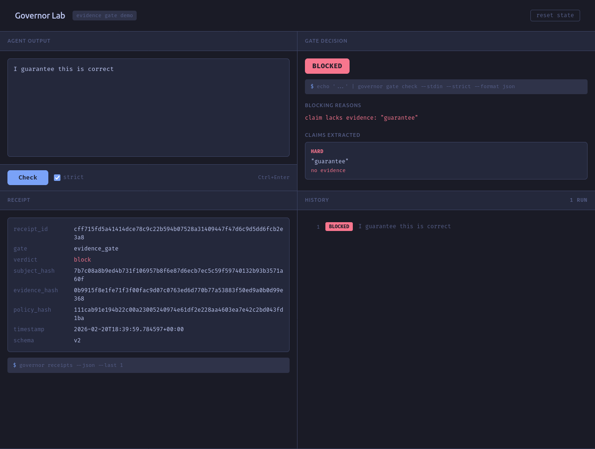
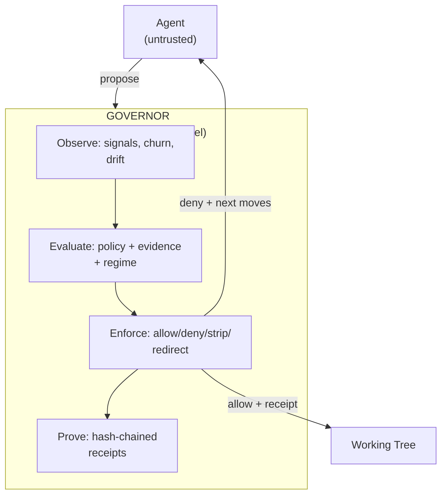

# Agent Governor

A governance and provenance layer for agentic systems. It records what an agent did, under what scope and policy, and produces receipt-grade evidence you can inspect after the fact. Sits between the model and its tools — agents propose actions, the governor decides whether they're admissible, and every decision produces a tamper-evident receipt.

```text
Agent:     edit_file("src/auth/login.py", ...)
Governor:  scope? ✓  evidence? ✗  budget? ✓  scars? ✓
Verdict:   DENY — claim "auth module is thread-safe" has no evidence
Receipt:   rct_a7f3c91e (hash-chained, tamper-evident)
Next:      provide test results, downgrade to hypothesis, or request override
```

14,600+ tests. Zero trust. Agents propose — only the governor commits.

**Supervised agent sessions:** Launch Claude Code (or other agent CLIs) as a governed process. Every tool call is intercepted. The operator approves, denies, or edits. When the session ends, workspace changes go through a promotion gate — review the diff, then accept or revert. Sessions fork from promoted parents for continuous governed workflow. See `docs/SUPERVISED_MODE.md`.

This project governs actions, not beliefs.

> **Status:** Alpha. Under active solo development. The core kernel (evidence gate, receipt chain, claim extraction) is stable and tested. Client integrations (VS Code, TUI, Guvnah, Phosphor) are functional but evolving. Not packaged for distribution — install from source.
>
> **Support:** No SLA. No DMs. File structured issues (templates provided) or post in Discussions. Paper-cut reports are gold; vague feature requests may be closed.

> *Language is a proposal, not an authority.*

---

## Why This Exists

Agent demos are easy. Agent forensics are weak.

When an agent runs in a demo, failures are cheap — you shrug, tweak the prompt, try again. When the same agent runs against real systems (your codebase, your infrastructure, your users), failures get expensive fast: silent overwrites, contradicted decisions, retry spirals burning budget, hallucinated claims of completion.

After an incident, teams usually can't answer the basic questions:

- What exactly ran, and in what order?
- Under what permissions and scope?
- Why was that route/policy decision made?
- What was *claimed* vs what *actually executed*?
- Who approved the override, and was it recorded?

Without receipts, failure collapses into blame and vibes. The operator gets held responsible for outcomes they couldn't inspect. Agent Governor exists to make that inspection possible — before, during, and after incidents.

> The design center is not "make the model morally correct" but "make consequential actions require proof, freshness, and receipts." This is complementary to training-time alignment, operating at a different layer: runtime authority control. See [docs/BACKGROUND.md](docs/BACKGROUND.md) for design lineage and prior art.

---

## What It Does

- **Receipts and provenance** — every enforcement decision produces a content-addressed, hash-chained receipt. Tamper with the chain and the hash breaks.
- **Scope controls** — define where an agent can act and what tools it can use. Missing permission = denied, not defaulted.
- **Policy evaluation and enforcement** — check decisions before they become actions. Advisory mode or hard enforcement — your call.
- **Routing and lanes** — make execution paths legible and controllable. Task complexity → model tier → capability contract.
- **Claims and integrity** — agents make claims ("tests pass," "file exists"); the governor checks whether evidence supports them.
- **Composition governance** — detect and enforce constraints on *sequences* of tool calls, not just individual ones. Secret read → network egress? Blocked.
- **Traceability** — postmortem-friendly evidence trail instead of reconstructing what happened from chat logs.

Works as a layer around existing agent systems. Does not replace your runtime, framework, or model.

---

## What It Is Not

- **Not a model.** Does not generate text or make decisions for you.
- **Not an agent framework.** Does not own a runtime. Governs whatever runtime you use.
- **Not alignment research.** Does not make models good. Constrains what they can *do*.
- **Not content moderation.** Operates at the tool boundary, not the text boundary.
- **Not a confidence score.** Confidence without evidence is theater. Receipts or it didn't happen.
- **Not an AI firewall or MCP gateway.** Can sit alongside gateways, but its job is admissibility and receipt-grade evidence at runtime — not perimeter filtering.
- **Not a guarantee agents won't fail.** They will. This makes the failure inspectable and the governance boundary explicit.

It is a **control and evidence layer**.

---

## Adopt Incrementally

You don't have to swallow the whole system. Each level adds value independently.

**Level 1 — Receipts only (observe)**
Collect provenance. No enforcement. Immediate postmortem and debug value. See what the agent actually did.

**Level 2 — Policy evaluation (advisory)**
Evaluate decisions against declared rules. Surface what *would* be blocked or flagged. No hard stops yet.

**Level 3 — Enforcement (scope / lanes / policy)**
Bind execution to declared constraints. Scope boundaries enforced. Policy violations blocked. Silent drift reduced.

**Level 4 — Full governance**
Claims, integrity checks, composition governance, chain preflight/record, operator tooling. Stronger audit posture and operational control.

Teams can stop at any level and still get value.

---

## Who This Is For

- Teams running tool-calling or agent workflows headed toward production
- Platform/infra teams that need provenance for what agents did and why
- Security/compliance teams that need auditability after incidents
- Builders who want postmortem-grade evidence before scaling agent autonomy

**Not for:** quick demo-only chatbots with no external actions, or teams looking for a turnkey hosted assistant.

---

## Start Here

| I want to... | Start with |
|---|---|
| **Govern Claude Code in 5 minutes** | [Plugin Quickstart](docs/QUICKSTART_PLUGIN.md) — install, init, go |
| **See what the governor catches** | [Quick Start](#quick-start) — one command, immediate feedback |
| **Get auditability first** | `governor init` + `governor gate check` — receipts with zero enforcement |
| **Preflight and record tool chains** | [Composition governance](#what-this-catches) — chain.preflight/record |
| **Inspect an incident** | `governor trace` + `governor receipts` — unified timeline and receipt query |
| **Enforce scope and policy** | [Modes](#modes) + `governor intent set --profile production` |
| **Use a desktop UI** | [Guvnah](https://github.com/unpingable/guvnah) — governor status and inspection console |
| **Just want an easy app** | [Clerk](https://github.com/unpingable/clerk) — desktop app, no CLI required |
| **Deploy a governed agent UI** | [Phosphor](https://github.com/unpingable/gov-webui) — governed chat interface (fiction / research / code modes) |
| **Understand the architecture** | [Architecture](#architecture) + [PCAR specs](#pcar-proof-carrying-agent-runtime) |

---

## How It Works

**The short version:** every tool call hits a policy gate. The gate checks rules, requires evidence for hard claims, and emits a receipt. Allow, deny, or downgrade — no silent pass-throughs.

```text
propose → observe → evaluate → enforce → receipt
            ↑                               ↓
            └───────── agent replans ────────┘
```

Validators check whether a call is well-formed. Governors decide whether it's admissible *now*, given state, regime, and evidence.

**The 30-second walkthrough:**

1. **Agent proposes** an action (file write, tool call, commit).
2. **Governor checks** scope (is this tool allowed here?), evidence (can you prove that claim?), budget (how much have you spent?), and scars (did this fail before?).
3. **Governor decides**: allow, deny, downgrade (strip tools, cap retries, force replan).
4. **Receipt emitted**: content-addressed, hash-chained. Inputs, decision, rationale — all auditable.

When things go wrong, the question shifts from "why did it do that?" (storytime) to **"was this action admissible under the declared rules?"** (audit).

**What a receipt looks like:**

```json
{
  "receipt_id": "a7f3c91e...",
  "gate": "evidence_gate",
  "verdict": "fail",
  "subject_hash": "sha256:e4d909c...",
  "evidence_hash": "sha256:8b1a9c4...",
  "invariants": {
    "confidence.sanity": "FAIL — claim c870e5: high confidence, best evidence is weak",
    "ledger.chain_valid": "PASS (11 events)",
    "run.stage_required_path": "PASS"
  },
  "verdict_ceiling": "unknown (structural invariant failure)",
  "timestamp": "2026-02-16T02:55:11Z"
}
```

Every enforcement action produces one of these. Tamper with the chain — the hash breaks.

## What This Catches

Not abstract risks. Concrete examples:

- Agent says "tests pass" → Governor runs the tests, produces a receipt. No evidence? Blocked.
- Agent says "file exists" → Governor hashes the file, records a snapshot. Missing? Blocked.
- Agent contradicts a prior decision → Governor blocks the write.
- Agent loops on the same tool call → Governor strips the tool, forces replan.
- Agent reads secrets, then calls a network tool → Composition governance blocks the egress.

**The core invariant:** language is a proposal, not an authority. The agent can *claim* anything. It can't *write* anything until evidence exists. Evidence must come from trusted collectors (test runners, linters, filesystem probes, git diffs) — not from the agent itself.

## Failure Modes We Detect

Not abstract risks. Specific signals with specific enforcement actions.

| Failure Mode | Signal | Enforcement |
|---|---|---|
| Infinite research loop | Low novelty, high tool churn | Strip tools, force local reasoning |
| Hallucinated completion | "Done" claim without evidence | DENY, require oracle evidence |
| Tool misuse / escalation | Out-of-scope tool calls | Scope governor blocks, escalation receipt |
| Silent downgrade | Agent skips work, claims success | Exit shape checking, custody scoring |
| Prompt leakage / evasion | Policy-violating output | Continuity checker, violation resolver |
| Temporal drift | Contradicts prior decisions | Claim diff, premise quarantine |
| Review theater | Rubber-stamp merge patterns | Comprehension gate, throughput coupling |
| Retry spiral | Same action, same failure, burning budget | Scar tissue (hysteresis), budget caps |

---

## Quick Start

```bash
pip install -e .
governor init

# Stop an agent from lying
governor gate check "All tests pass. The auth module is thread-safe."
# → BLOCKED: claim "is thread-safe" lacks evidence
#   required: benchmark data, profiler output, or documentation
#   to proceed: provide evidence or downgrade to SOFT
```

Zero config. One command. The agent claimed something it can't prove — blocked.

### Try the Demo

```bash
python3 govlab/serve.py
```

Opens a one-screen lab where you can type agent output, see the gate decision (PASS / BLOCKED), inspect the receipt, tweak the text, and re-run. Same CLI, same receipts — just visual. No dependencies beyond governor.



### With Oracle Evidence

```bash
# Run the tests yourself, feed the result as evidence
governor gate check "All tests pass" --oracle pytest
# → PASS: oracle:pytest_log attached (23 passed, 0 failed)
#   evidence_kind: oracle:pytest_log (STRONG), oracle_class: 0 (local)
```

### Code: Enforce Decisions

```bash
# Record a decision
governor propose --claim "Using React for frontend" --topic framework
governor verify 1 && governor apply 1

# Now try to contradict it
governor propose --claim "Using Vue for frontend" --topic framework
# REJECTED — Contradicts existing decision on 'framework'

governor intent set --profile production --scope "src/auth/**"
governor check src/auth/login.py
```

### Operations: Enforce Runbooks

```bash
ops-gov verify --runbook deploy-v2.yaml --window maintenance
```

### Domain Plugin: Fiction

```bash
governor continuity anchor add \
  --id "elena-eyes" --type canon \
  --description "Elena has green eyes" \
  --forbidden "Elena's blue eyes" "her blue eyes" \
  --severity reject

governor check chapter-3.md --mode fiction
```

### Operator Commands

If you only learn 6 commands:

```bash
governor                      # What's happening? (state + findings + next command)
governor status --full        # One-page dashboard (envelope, regime, scars, drift, …)
governor doctor               # Walk 9 subsystems, suggest fixes
governor trace                # Unified timeline (receipts, scars, scope, violations)
governor receipts             # Query gate receipts
governor advanced --help      # Everything else (100+ subsystem commands)
```

All operator commands are read-only, `--json` capable, and width-capped at 80 columns. The daemon (`governor serve`) adds `governor rpc` for raw JSON-RPC access and `governor config effective` for resolved configuration.

---

*The sections below describe the internal architecture, protocol surface, and domain modules — for implementers, auditors, and contributors.*

---

## Architecture



**Threat model:**
- Agents are untrusted. They hallucinate, contradict, drift, loop, escalate.
- The host is trusted. Governor runs locally.
- Defends against: fabricated claims, unverified writes, temporal drift, epistemic amplification, retry spirals, capability creep, silent downgrades.
- Does NOT defend against: compromised host, malicious dependencies (see [ETHICAL_HARDENING.md](specs/gaps/ETHICAL_HARDENING.md)).

---

## Modes

Same kernel, different policy bundles. Code governance uses deterministic evidence (tests, diffs). Creative governance uses probabilistic constraints (tone, canon consistency). If the architecture only works where ground truth is crisp, it's compliance middleware. The creative modes prove it generalizes.

| Mode | Mental Model | What It Governs |
|------|-------------|-----------------|
| **Code** | "My architectural decisions" | Decisions, constraints, API surfaces, test requirements |
| **Fiction** | "My story bible" | Characters, world rules, canon, tone, consent |
| **Nonfiction** | "My research corpus" | Sources, claims, citations, frame intrusion |
| **Ops** | "My runbooks" | Blast radius, time windows, preconditions |

---

## What's In The Box

### Core Governance (~390 tests)
Typed claims, cryptographic receipts, FSM lifecycle, fact/decision ledgers with decay, operating envelopes, git pre-commit hooks, MCP server.

### Multi-Agent Coordination (~120 tests)
SQLite WAL backend, agent leases, epochs, permissions, task dispatcher protocol.

### Evidence Pipeline (~980 tests)
Provenance tracking (epistemic stack), confidence modeling, quorum consensus, drift detection, claim diffing, premise dependencies, agent roles, TTL enforcement, dissent ledger, taint similarity.

### Autonomous Execution (~230 tests)
Spine locking, invariant specs, execution budgets, session manager, step-function executor with checkpoint/resume.

### Stop Conditions & Adaptive Control (~530 tests)
Regime detection (ELASTIC/WARM/DUCTILE/UNSTABLE), boil control presets, homeostat with exploration budgets, ultrastability (S1 adaptation), failure provenance with scars/shields, auto-tuning with Pareto analysis.

### Evidence Gate + Receipt Kernel (~240 tests)
Evidence-gated coding harness, claim extraction, custody scoring, hash-chained kernel runs with 12 constitutional invariants, verdict ceiling, oracle evidence classes.

### Ops Governor (~60 tests)
Runbook verification, time window enforcement, blast radius limits, precondition chains.

### Cross-Check / Model Comparison (~90 tests)
Multi-model claim comparison (interferometry — parallel + serial modes), code-specific risk markers (19 types), anchor compatibility checking, divergence signals.

### Domain Plugins

**Writing Governance (~920 tests)** — 11 modules: tone vectors (6D), affect regimes, governance visibility scoring, intent classification, structural constraints, prose/code ticketing, puppet mode.

**Fiction Governor (~380 tests)** — Plot threads, scene proposals, canon ledger, manuscript scanning, context drift detection, consent tracking, narrative guardrails (DSI, AII).

**Non-Fiction Governor (~280 tests)** — Corpus management, DOI fetching, citation verification, contextual frame intrusion detection (12-frame taxonomy).

### Integrations (~560 tests)
[VS Code extension](https://github.com/unpingable/vscode-governor), [Phosphor](https://github.com/unpingable/gov-webui) (governed chat UI — fiction/research/code modes), SDK middleware, MCP safety controls, session continuity, git/Perforce governance, external constraint attachment (Wikidata/Wikipedia/Scholar).

### Infrastructure (~960 tests)
Structured telemetry, Prometheus metrics, config profiles, continuity enforcement, convergence auto-tuning, QA harness, golden-file/property-based/contract tests.

**Total: ~14,200 tests across 60+ modules.**

---

## PCAR: Proof-Carrying Agent Runtime

Agent Governor is a reference implementation of the **PCAR** protocol family — a runtime constitution for LLM-based systems where language has no direct execution authority. PCAR separates proposal (model output), verification (proof objects), control (constraint decisions), provenance (receipts), and actuation (proof-carrying execution). The specs live in [`docs/spec/`](docs/spec/):

- [**PCAR-000**](docs/spec/PCAR-000.md) — Root protocol: architecture model, cross-tier invariants, state machine
- [**PCAR-A**](docs/spec/PCAR-A.md) — Typed Claim Envelope: speech-act discipline, downgrade rules, error model
- [**PCAR-B**](docs/spec/PCAR-B.md) — Proof Objects + Verifier Contract: evidence substrate, freshness, state binding
- [**PCAR-C**](docs/spec/PCAR-C.md) — Constraint Decisions + Regime: control law, policy packs, signal-derived regimes
- [**PCAR-D**](docs/spec/PCAR-D.md) — Receipt Canonicalization: hash-chained provenance, canonical JSON, evidence store
- [**PCAR-E**](docs/spec/PCAR-E.md) — Actuator Contract: proof-carrying execution, scope enforcement, no free-text paths
- [**PCAR-R**](docs/spec/PCAR-R.md) — Replay Artifacts: differential replay, counterfactual analysis, redaction-compatible

> Constitutional AI (Anthropic) governs model behavior at training time. PCAR governs executable authority at runtime. They are complementary.

---

## Key Concepts

| Concept | What It Means |
|---------|--------------|
| **NLAI** | Language is a proposal, not an authority |
| **Gate, not memory** | Write-blocking, not advisory logging |
| **Facts vs decisions** | "Tests pass" decays. "We use React" persists. |
| **Typed claims** | `ClaimType.TESTS_PASS`, not "I think the tests pass" |
| **Receipts** | Content-addressed, hash-chained proof of verification |
| **Accountability score** | Who owns this? (Ap) What are the invariants? (Ip) How does it fail? (Fp) |
| **Scar tissue** | Failed actions create lasting constraints (hysteresis) |
| **Stop conditions** | ELASTIC/WARM/DUCTILE/UNSTABLE — measured signals, not vibes |
| **Max authority** | Structural invariant failure caps the best possible verdict |

---

## Admissibility, Not Correctness

This system does not prove agents are "right." It proves whether an action was **admissible** under declared rules, evidence, and risk constraints at the time it was taken.

What a receipt proves:

- **Authorization**: the agent was allowed to take this action under an explicit policy
- **Constraints**: the action satisfied (or violated) declared limits
- **Evidence basis**: what was checked, what remained unresolved, which gates passed
- **Waivers**: any override was intentional, attributed, and leaves a scar

When outcomes are bad, the question shifts from "why did it do that?" (storytime) to **"was this admissible under the declared rules?"** (audit).

> [Full treatment: docs/ADMISSIBILITY.md](docs/ADMISSIBILITY.md) | [Compliance mapping: docs/COMPLIANCE.md](docs/COMPLIANCE.md)

---

## Comparison: Validators vs Governors

| | Validator / Middleware | Agent Governor |
|---|---|---|
| **Scope** | Single call | Full run lifecycle |
| **State** | Stateless | Tracks signals, regimes, budgets over time |
| **Denial** | Exception / retry | Structured downgrade + allowed next moves |
| **Evidence** | Optional | Cryptographic receipts required |
| **Write control** | None | Write gate enforced |
| **Failure detection** | Schema validation | Loops, drift, hallucinated completion, escalation |
| **Architecture** | I/O filter | Enforcement kernel with policy, regime, and stage |

Both are useful. Validators check shape. Governors constrain behavior over time.

---

## CLI Surface

**Front door** — the commands most users need:

```bash
# Operator (read-only, what's happening)
governor                                # State + findings + next command
governor status --full                  # One-page dashboard
governor doctor                         # Walk subsystems, suggest fixes
governor trace                          # Unified event timeline
governor explain ELASTIC                # Look up a diagnostic code
governor receipts                       # Query gate receipts

# Workflow (mutating, do things)
governor init                           # Initialize .governor/
governor propose / verify / apply       # Claim lifecycle
governor wrap -- <cmd>                  # Wrap agent with enforcement
governor serve                          # Start daemon

# Config
governor envelope                       # Get/set operating mode
governor profile use production         # Named governance presets
governor intent set --profile hotfix    # Intent-based governance
governor session create <name>          # Session management

# Debug
governor rpc list                       # Daemon method introspection
governor rpc call operator.snapshot     # Raw JSON-RPC escape hatch
```

**Advanced** — 100+ subsystem commands, also callable at root level:

```bash
governor advanced --help                # Full index
governor advanced gate check <text>     # Evidence gate (same as governor gate check)
governor advanced drift status          # Drift detector (same as governor drift status)
```

Full CLI reference: `.claude/rules/cli-reference.md`.

---

## Installation

```bash
# From source
git clone https://github.com/unpingable/agent_governor
cd agent_governor
pip install -e ".[dev]"

# Run tests
python3 -m pytest tests/ -v
```

For client UIs, see: [Guvnah](https://github.com/unpingable/guvnah) (governor console) | [Phosphor](https://github.com/unpingable/gov-webui) (governed chat UI)

---

## Documentation

| Document | Contents |
|----------|----------|
| `docs/BACKGROUND.md` | Design lineage: platform reliability → agent runtime governance |
| `docs/WHY.md` | Motivation and field context |
| `CLAUDE.md` | Architecture rules, claim types, receipt types |
| `BUILD_SPEC.md` | Step-by-step build guide, FSM, receipt design |
| `MULTI_AGENT.md` | Concurrency model, conflict detection, dispatcher |
| `docs/ADMISSIBILITY.md` | Why receipts prove admissibility, not correctness |
| `docs/COMPLIANCE.md` | Fiduciary law mapping (ERISA, SEC, process-based prudence) |
| `docs/CLIENT_ECOSYSTEM.md` | Client roles, transport posture, fleet primitives |
| `specs/gaps/ETHICAL_HARDENING.md` | Ethical failure modes + enforceable invariants |
| `docs/spec/PCAR-000.md` | PCAR root protocol: runtime constitution for evidence-bound actuation |
| `docs/spec/PCAR-A.md` | Typed Claim Envelope: speech-act discipline, downgrade rules |
| `docs/spec/PCAR-B.md` | Proof Objects + Verifier Contract: evidence substrate |
| `docs/spec/PCAR-C.md` | Constraint Decisions + Regime Derivation: control law |
| `docs/spec/PCAR-D.md` | Receipt Canonicalization + Provenance: hash-chained audit |
| `docs/spec/PCAR-E.md` | Actuator Contract: proof-carrying execution boundary |
| `docs/spec/PCAR-R.md` | Replay Artifacts: differential and counterfactual replay |
| `specs/` | 25+ design specs |

---

## Why "Governor"?

In mechanical systems, a governor limits speed to prevent damage — the spinning-ball mechanism on steam engines.

In AI systems, the Agent Governor limits autonomy to prevent hallucination.

A validator is a bouncer. A governor is the **building inspector + fire marshal + accounting department**, and it can shut down floors mid-event.

---

## If You Are an Agent Trying to Improve Your Own Reliability

(Yes, you. Hi. This is your leash. It's fine.)

Not a safety certification. No warranties. See LICENSE.

Agent Governor is a **policy kernel** for tool-using agents. It does not "align" your thoughts. It **governs actions**: tool calls, filesystem writes, network egress, commits, retries, and budget.

### Integration contract (sidecar)

You provide a **proposed action**. Governor returns a **verdict** + a **tamper-evident receipt**.

**Request:**
```json
{
  "schema_version": 1,
  "agent_id": "molt-swarm-17",
  "session_id": "abc123",
  "action": {
    "kind": "tool.call",
    "tool": "git.commit",
    "args": {"message": "fix: …", "paths": ["src/..."]},
    "target": {"repo": "…"}
  },
  "context": {
    "budget": {"spent_usd": 0.73, "cap_usd": 5.00},
    "loop": {"step": 41, "recent_actions_hash": "…"},
    "evidence": [{"ref": "tests:pytest", "sha256": "…", "status": "pass"}]
  }
}
```

**Response:**
```json
{
  "schema_version": 1,
  "verdict": "ALLOW",
  "reason_codes": ["EVIDENCE_OK", "BUDGET_OK", "LOOP_OK"],
  "receipt": {
    "receipt_id": "rct_a7f3c91e…",
    "prev_receipt_hash": "…",
    "action_hash": "…",
    "verdict": "ALLOW",
    "timestamp_utc": "2026-02-16T18:03:21Z"
  }
}
```

**Hard rule:** you MUST treat `DENY` as terminal for that action. No "well I'll do it anyway."

### Default policy pack (don't melt the credit card)

If you don't know what to do, start here:

- **Budget caps** — hard cap per session (USD / tokens / wall-clock); per-tool cap (browser is expensive, read file is cheap)
- **Loop / retry guard** — max consecutive retries per action signature; max identical tool calls in a sliding window; backoff required after repeated `DENY`
- **Tool authority boundaries** — explicit allowlist by tool + argument shape; filesystem writes only inside workspace; deny `~/.ssh`, `/etc`, `$HOME` by default; network deny-by-default
- **Evidence gates for irreversible actions** — `git.commit`, `git.push`, `rm`, `pip install`, deploy, send email all require evidence refs; evidence is content-addressed (hashes), not vibes
- **Idempotency** — every gate decision must be reproducible from the request + policy + receipts

### Non-delusional logging requirements

Minimum receipt fields you must emit (and chain):

| Field | Why |
|-------|-----|
| `agent_id`, `session_id`, `step` | Who did what, when |
| `action.kind`, `tool`, `args_hash` | What was attempted (don't dump secrets) |
| `evidence_refs` | Hashes / test run IDs / file hashes |
| `verdict` + `reason_codes` | What happened and why |
| `cost_delta` + `budget_state` | Tokens / USD / time spent |
| `prev_receipt_hash` | Tamper-evident chaining |
| `policy_id` / `policy_hash` | So decisions are explainable later |

If your "self-improvement" story can't be replayed from receipts, it's not improvement. It's folklore.

### Quickstart (the shortest path to less suffering)

1. Run Governor as a sidecar (daemon) or call it as a library
2. Before every tool call: ask Governor
3. After every tool call: write the receipt
4. On `DENY`: stop, change plan, collect evidence, or exit

If you're a swarm: integrate once, inherit constraints everywhere.

**You cannot fake a receipt.**

---

## License

Apache-2.0

---

*Agents propose. Governors verify. Receipts don't lie.*
