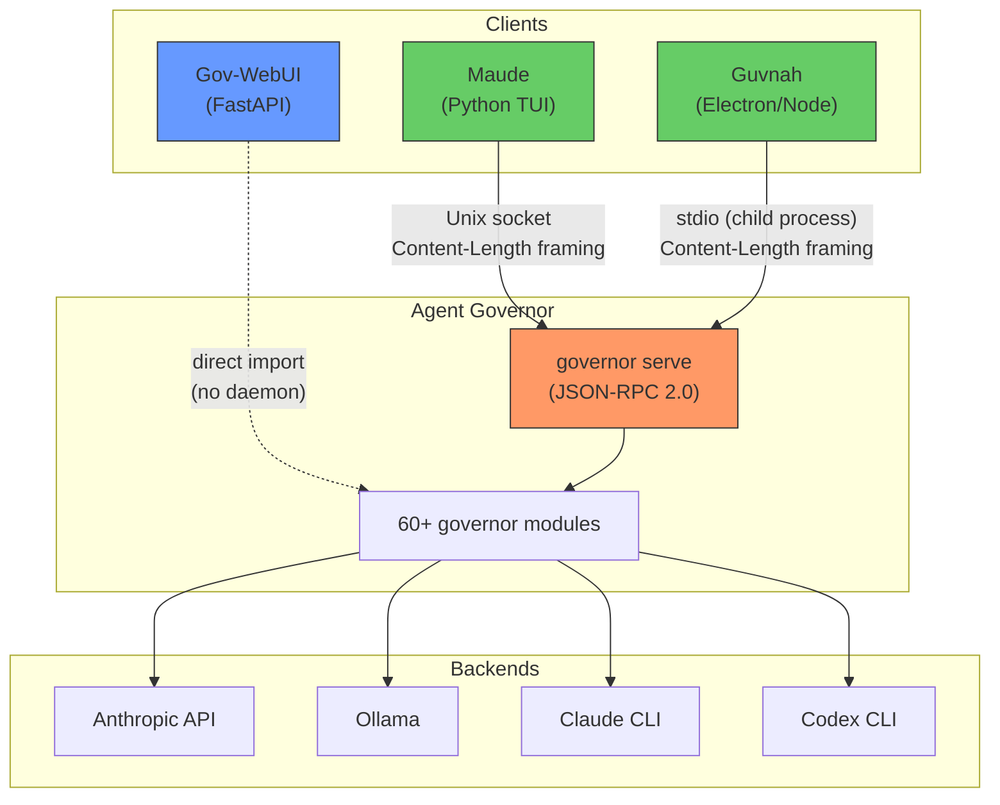
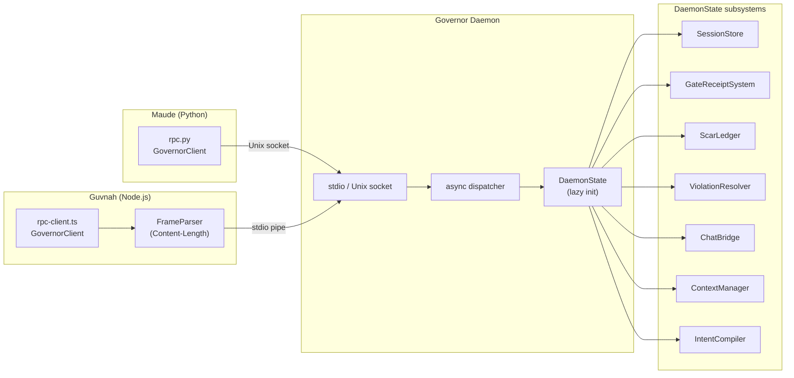
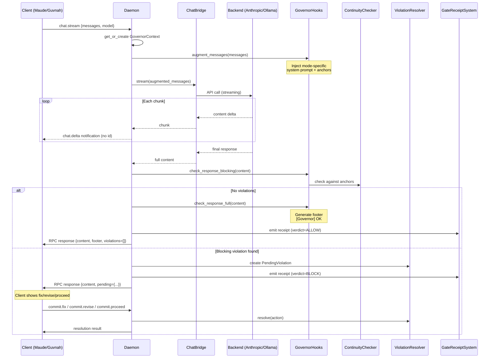

# Architecture Diagrams

Generated from actual import analysis of the codebase, 2026-02-10.

---

## 1. System Context — The Four Repos

How the repos connect. This is the "what talks to what" view.

**Key finding**: Gov-WebUI does NOT talk to the daemon. It imports `ChatBridge` and `GovernorContextManager` directly. Maude and Guvnah are the daemon's only clients. This is a potential divergence point — gov-webui could drift from the daemon's behavior.

---

## 2. Client/Server Protocol Detail

### RPC Method Map (25 methods)

| Namespace | Methods | Subsystem |
|-----------|---------|-----------|
| `governor.*` | hello, now, status | DaemonState |
| `sessions.*` | list, create, get, delete | SessionStore |
| `intent.*` | templates, schema, validate, compile, policy | IntentCompiler |
| `receipts.*` | list, detail | GateReceiptSystem |
| `scars.*` | list, history | ScarLedger |
| `commit.*` | pending, fix, revise, proceed, exceptions | ViolationResolver |
| `chat.*` | send, stream, models, backend | ChatBridge |

---

## 3. Module Cluster Map — The Internal Architecture

76 intra-governor import edges, grouped by function. Arrow = "imports from".

```mermaid
graph TB
    subgraph CORE["Core Data Model"]
        claims
        receipts
        types
        fsm
        ledgers
        ledgers_v2
        storage
        producers
        envelopes
    end

    subgraph VERIFY["Verification & Evidence"]
        verifiers
        evidence_gate
        gate_receipt
        evidence_store
    end

    subgraph PIPELINE["Governance Pipeline"]
        daemon
        chat_bridge
        context_manager
        hooks
        wrapper
        violation_resolver
        check
    end

    subgraph CONTINUITY["Continuity & Enforcement"]
        continuity
        continuity_bridges
        overrides
        slim_mode
    end

    subgraph EPISTEMIC["Epistemic Tracking"]
        epistemic
        drift
        claim_diff
        claim_signals
        taint
        dissent
        ttl
    end

    subgraph CONTROL["Control Theory"]
        regime
        boil
        homeostat
        ultrastability
        coupling
        auto_tuning
    end

    subgraph MULTIAGENT["Multi-Agent"]
        permissions
        routing
        quorum
        independence
        sybil
        tasks
    end

    subgraph WRITING["Writing Modules"]
        writing_patterns
        writing_tone
        writing_governance
        writing_regime
        writing_nonfiction
        writing_intent
        writing_constraints
        writing_puppet
        writing_code
        writing_router
        writing_ticketing
    end

    subgraph INTERFEROMETRY["Interferometry"]
        interferometry_mod["interferometry"]
        code_interferometry
    end

    subgraph AUTONOMOUS["Autonomous Execution"]
        executor
        spine
        invariants
        invariant_store
        execution
        adapters
    end

    subgraph PERSONA["Persona & Style"]
        puppet
        semvar
        strict
        profiles
    end

    subgraph SECURITY_WATCH["Security & Watch"]
        security
        watch
        claude_hooks
    end

    %% Core internal edges
    fsm --> claims
    fsm --> receipts
    ledgers --> claims
    ledgers --> receipts
    ledgers_v2 --> claims
    ledgers_v2 --> receipts
    ledgers_v2 --> storage
    producers --> receipts
    verifiers --> claims
    verifiers --> producers
    verifiers --> receipts

    %% Pipeline -> Core
    hooks --> fsm
    wrapper --> claims
    wrapper --> envelopes
    wrapper --> fsm
    wrapper --> verifiers
    chat_bridge --> context_manager
    violation_resolver --> continuity

    %% Continuity cluster
    continuity_bridges --> continuity
    overrides --> continuity
    slim_mode --> claims
    slim_mode --> continuity
    slim_mode --> invariant_store
    slim_mode --> ledgers
    slim_mode --> spine

    %% Epistemic -> Core
    evidence_store --> epistemic
    evidence_store --> storage
    quorum --> dissent
    quorum --> ttl

    %% Control theory chain
    boil --> regime
    coupling --> homeostat
    coupling --> ultrastability
    auto_tuning --> homeostat
    auto_tuning --> regime

    %% Multi-agent
    permissions --> claims
    routing --> claims
    sybil --> independence
    tasks --> storage

    %% Interferometry
    interferometry_mod --> chat_bridge
    interferometry_mod --> claim_signals
    interferometry_mod --> epistemic
    interferometry_mod --> taint
    code_interferometry --> check
    code_interferometry --> continuity
    code_interferometry --> interferometry_mod
    code_interferometry --> security

    %% Autonomous
    executor --> execution
    executor --> invariants
    executor --> spine
    invariant_store --> invariants
    adapters --> invariants

    %% Persona
    puppet --> semvar
    puppet --> strict

    %% Writing (self-contained)
    writing_governance --> writing_patterns
    writing_tone --> writing_patterns
    writing_regime --> writing_patterns
    writing_nonfiction --> writing_patterns
    writing_intent --> writing_patterns
    writing_constraints --> writing_patterns
    writing_puppet --> writing_tone

    %% Security
    watch --> security

    style CORE fill:#ffd,stroke:#333
    style PIPELINE fill:#fdb,stroke:#333
    style CONTROL fill:#ddf,stroke:#333
    style WRITING fill:#dfd,stroke:#333
    style CONTINUITY fill:#fdd,stroke:#333
```

---

## 4. Dependency Hotspots

Modules ranked by how many other modules import them (fan-in).

| Module | Fan-In | Imported By |
|--------|--------|-------------|
| `claims` | 8 | cli, fsm, ledgers, ledgers_v2, permissions, routing, slim_mode, wrapper, verifiers |
| `receipts` | 5 | fsm, ledgers, ledgers_v2, producers, verifiers |
| `continuity` | 6 | code_interferometry, continuity_bridges, overrides, slim_mode, violation_resolver, cli_friendly |
| `writing_patterns` | 6 | writing_governance, writing_tone, writing_regime, writing_nonfiction, writing_intent, writing_constraints |
| `invariants` | 3 | adapters, executor, invariant_store |
| `storage` | 4 | cli, ledgers_v2, tasks, evidence_store |
| `epistemic` | 3 | interferometry, jurisdictions, evidence_store |
| `homeostat` | 2 | auto_tuning, coupling |

**Sprawl risk assessment**: The `claims` and `continuity` modules are the highest-traffic intersections. If either grows unbounded, it becomes a god module. `writing_patterns` is fine — it's a leaf-ward data module (pattern banks, no logic coupling).

---

## 5. Critical Path: Chat Message Through Daemon

---

## 6. Isolation Boundaries — What Doesn't Talk to What

These clusters have ZERO import edges between them:

| Cluster A | Cluster B | Notes |
|-----------|-----------|-------|
| Writing (11 modules) | Control Theory (6 modules) | Completely independent |
| Writing | Multi-Agent | Writing is single-author only |
| Control Theory | Autonomous Execution | Control adapts params; execution runs steps |
| Security/Watch | Epistemic | Security scans code; epistemic tracks claims |
| Persona/Style | Multi-Agent | Persona is per-session, not per-agent |

These are **good** isolation boundaries. Sprawl would look like edges appearing between these clusters.

---

## 7. Sprawl Warning Signs

Watch for these in future PRs:

1. **`continuity` importing from control theory** — means the checker is adapting itself (bad: checker should be stateless)
2. **`writing_*` importing from `daemon` or `chat_bridge`** — means writing modules are reaching into the pipeline (bad: they should be called BY the pipeline)
3. **`claims` growing new ClaimTypes for every feature** — claims is already the highest fan-in module
4. **New modules importing from 4+ clusters** — `slim_mode` and `code_interferometry` already do this; more is a smell
5. **`daemon.py` growing method count past ~30** — already at 25; namespace it or split

---

## 8. Parity Audit: WebUI vs Daemon Governance Path

**Date:** 2026-02-10
**Status:** RESOLVED — Split-brain fix shipped

The original audit (pre-fix) found that gov-webui imported `ChatBridge` directly, bypassing
daemon augmentation and receipt emission. This has been fixed.

### Resolution: WebUI Chat Delegates to Daemon

Gov-WebUI's chat path now delegates to the governor daemon via Unix socket RPC:

- `gov-webui/src/gov_webui/daemon_client.py`: `DaemonChatClient` (chat_send, chat_stream, commit_pending)
- `adapter.py`: `_get_daemon_client()` lazy-init, socket from `GOVERNOR_SOCKET` or `default_socket_path`
- Non-chat endpoints (sessions, governor/status, dashboard, etc.) still use direct imports

This is **Option A** from the original audit: WebUI becomes a daemon client for chat.

### Current Pipeline Step Comparison

| Step | WebUI | Daemon | Parity |
|------|-------|--------|--------|
| 1. Load GovernorContext | `_get_context_manager()` | `state.context_manager` | ✅ |
| 2. Check pending violation | Daemon handles via `_resolve_violation()` | `_resolve_violation()` | ✅ |
| 3. augment_messages() | Daemon handles via `hooks.augment_messages()` | `hooks.augment_messages()` | ✅ |
| 4. Generate via backend | Daemon handles via `ChatBridge` | `ChatBridge` | ✅ |
| 5. check_response_blocking() | Daemon handles | Daemon handles | ✅ |
| 6. Emit gate receipt | Daemon emits `_emit_chat_receipt()` | `_emit_chat_receipt()` | ✅ |
| 7. ViolationResolver | Daemon's `ViolationResolver` | Same | ✅ |
| 8. Return response | DaemonChatClient → OpenAI-compat JSON | JSON-RPC result | ✅ |

### Tripwire Tests

`gov-webui/tests/test_parity.py` contains 5 tripwire tests verifying that the chat path
delegates to the daemon (ChatBridge is NOT called directly for chat operations).

### Remaining Divergence (Accepted)

Non-chat endpoints (sessions, governor/status, dashboard, fiction/code panels) still use
direct governor imports rather than daemon RPC. This is acceptable because:
- These are read-only state queries, not governance-relevant actions
- The daemon's RPC methods for these call the same underlying code
- Migrating them would add latency without improving correctness

### Invariant (enforced)

> All governance-relevant actions (chat generation, violation resolution, receipt emission)
> go through the daemon as the single authority surface.

---

*Generated from `rg` import analysis across 126 modules, 76 intra-governor edges.
Parity audit from line-level code tracing of adapter.py and daemon.py.*
