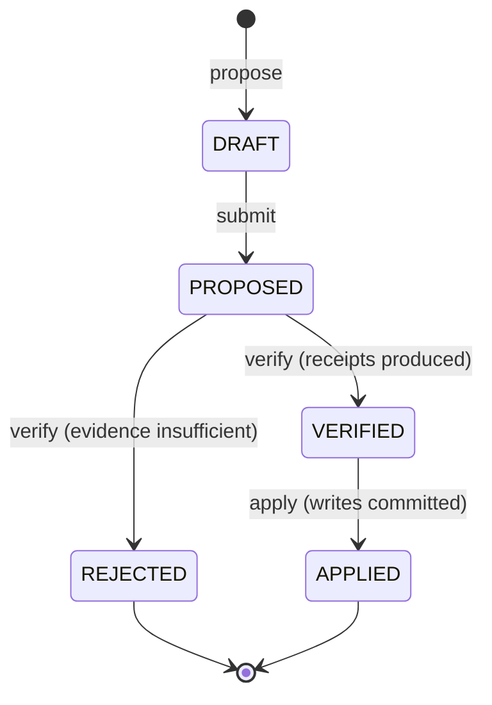
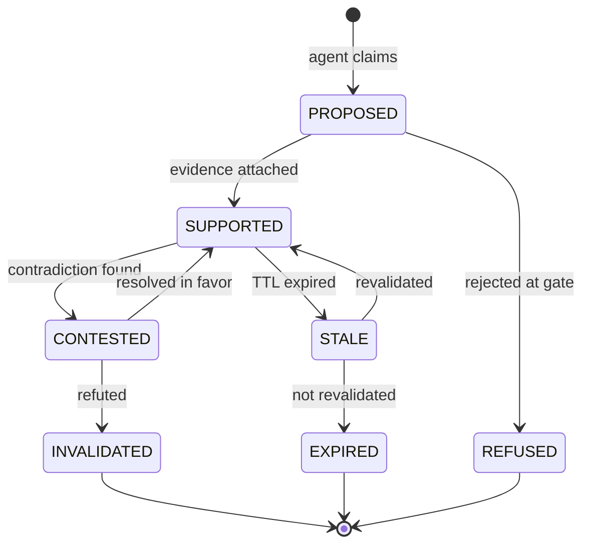
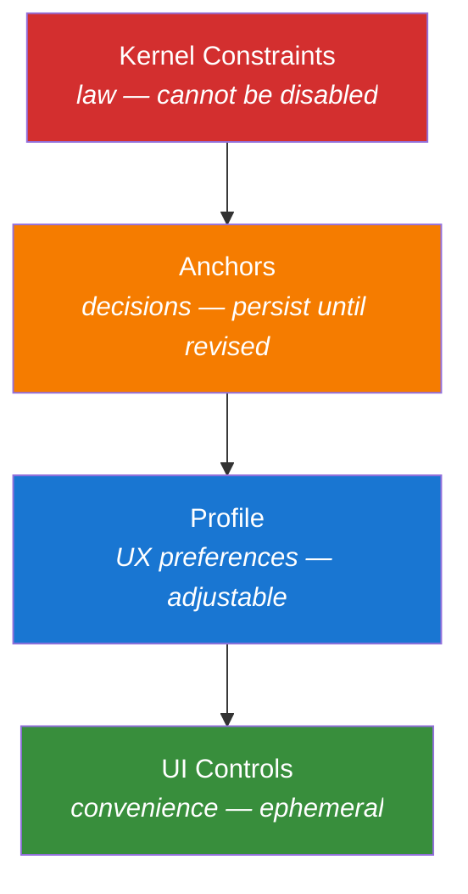
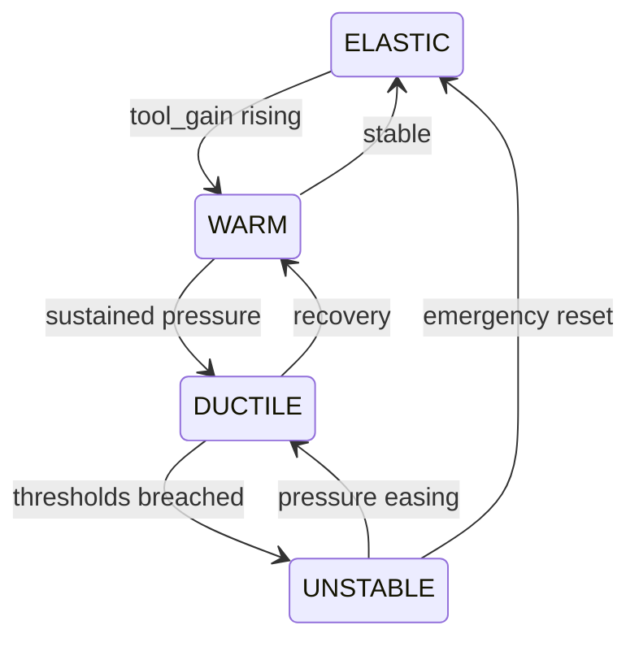
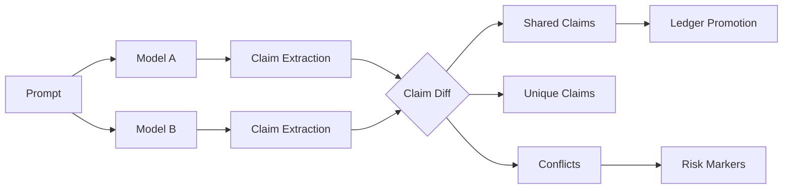
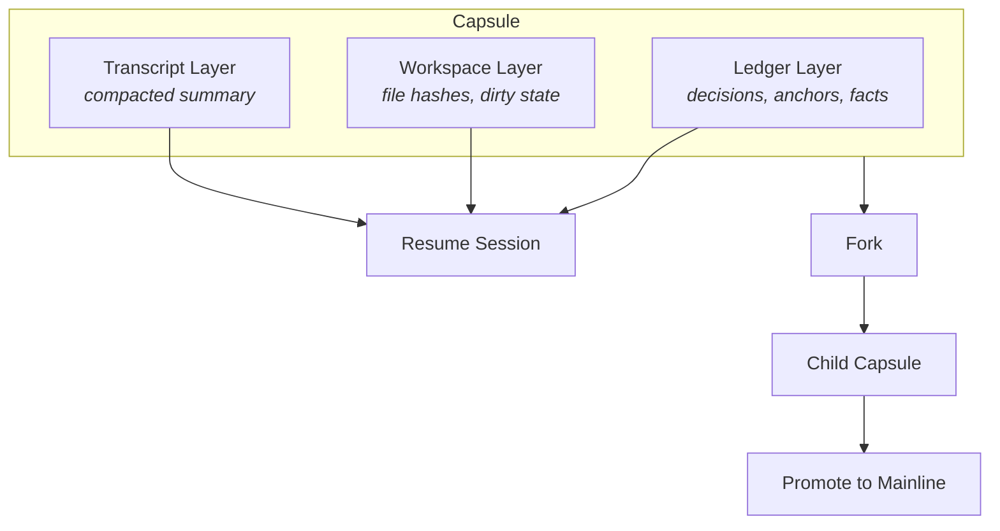
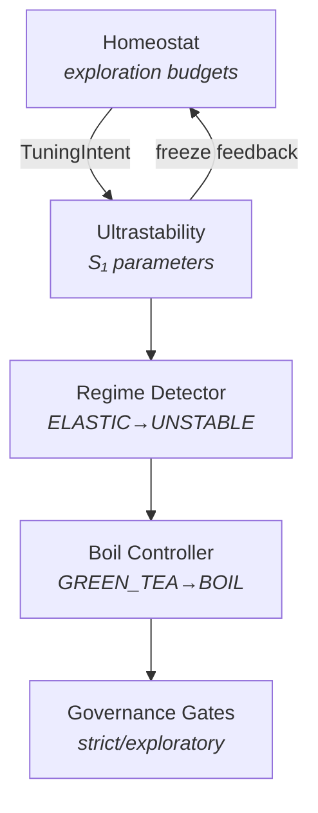
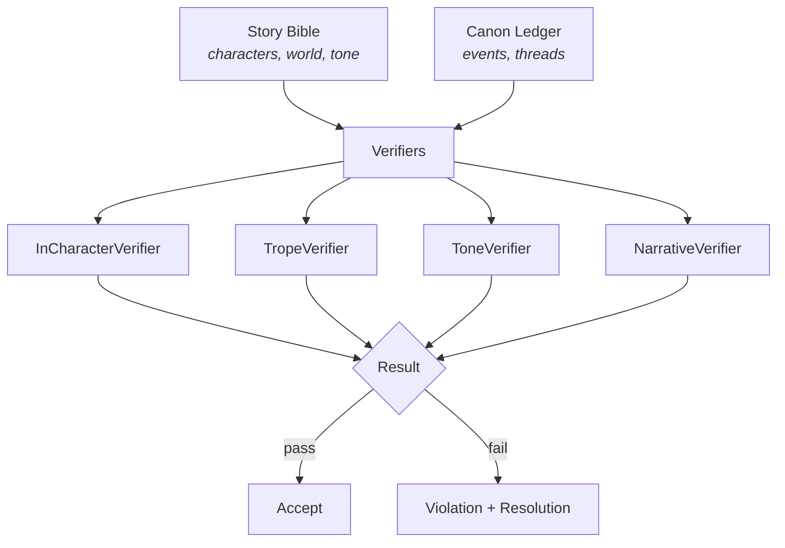

# Architecture Diagrams

Generated from system structure. If these drift from reality, regenerate — don't hand-edit.

---

## Run Lifecycle

## Claim Promotion

## Invariant Hierarchy

## Regime Detection

## Interferometry Flow

## Capsule Structure (Session Continuity)

## Adaptive Control Loop

## Fiction Governor

